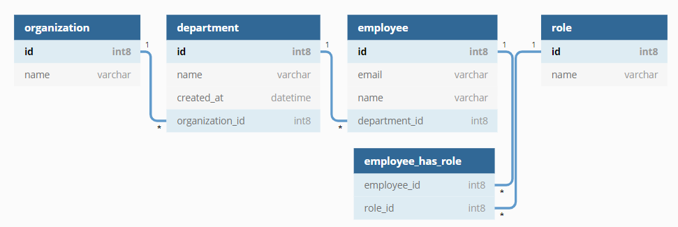

## Introduction
	
Spring-Data makes it really easy to implement the persistence layer of your application but when your domain model becomes more complex then also your queries will and you can't rely on the spring data query derivation mechanism anymore. Therefore you have to implement JPQL or native queries by using the `@Query` annotation. But there are some major drawbacks like:

- **Error-prone**: Handwrititen queries are a source for typos and cumbersome to write/read because of the not optimal formatting of multiline strings in Java (Hopefully will become better with [JEP-355]( https://openjdk.java.net/jeps/355 )). 
- **No type safety**: Type safety will be lost when writing queries as strings. This can lead to errors at runtime.
- **Hard to maintain**: When we change a column of an entity we also have to change the query string. The  IDE or the compiler are not able to detect those changes, therefore it is easy to run into errors at runtime.


To avoid those problems I will explain how to use a framework called [Querydsl](http://www.querydsl.com/) together with spring-data-jpa. The complete code of the demo application is available on [github](https://github.com/SnuK87/querydsl-playground).

> Querydsl is a framework which enables the construction of statically typed SQL-like queries. Instead of writing queries as inline strings or externalizing them into XML files they can be constructed via a fluent API like Querydsl. 


## Setup

In order to use Querydsl in your project you just have to add the following dependencies and a maven plugin to you `pom.xml`.

```xml
<dependency>
​	<groupId>com.querydsl</groupId>
​	<artifactId>querydsl-apt</artifactId>
	<scope>provided</scope>	
​</dependency>

​<dependency>
​	<groupId>com.querydsl</groupId>
​	<artifactId>querydsl-jpa</artifactId>
​</dependency>
```

The maven APT plugin with the `JPAAnnotationProcessor` scans your project for `@Entity` annotated classes and generates a corresponding query type that is prefixed with a `Q. Run `mvn clean compile` or build the project with eclipse to execute the plugin and generate the query types.
```xml
<plugin>
	<groupId>com.mysema.maven</groupId>
	<artifactId>apt-maven-plugin</artifactId>
	<version>1.1.3</version>
	<executions>
		<execution>
			<goals>
				<goal>process</goal>
			</goals>
			<configuration>
				<outputDirectory>target/generated-sources/java</outputDirectory>
				<processor>com.querydsl.apt.jpa.JPAAnnotationProcessor</processor>
			</configuration>
		</execution>
	</executions>
</plugin>
```

To write queries with Querydsl we need to autowire an instance of `JPAQueryFactory` into our repository implementation class. For that we can simply create a configuration class and create a `@Bean`.

##  Configuration

```java
@Configuration
public class QueryDslConfiguration {

	@PersistenceContext
	private EntityManager entityManager;

	@Bean
	public JPAQueryFactory jpaQueryFactory() {
		return new JPAQueryFactory(entityManager);
	}
}
```

## Domain model

Our domain model consists of four entities:
- Organization: An organization contains many departments
- Department: A department belongs to one organization and has many employees
- Employee: An employee is working for one department and has many roles
- Role: Each employee can have many roles




## Implementation

To combine the magic of the spring `JpaRepository` and Querydsl we have to create a new interface for our Querydsl powered queries first.

```java
interface EmployeeRepositorySupport {

	List<Employee> findByOrganizationId(Long organizationId);
	
	List<Employee> findByDepartmentIdAndRoleName(Long departmentId, String roleName);
	
	List<EmployeeDto> findByOrganizationIdAndRoleName(Long organizationId, String roleName);
	
}
```

Then we can create a new interface that extends the `JpaRepository` and our created iterface.

```java
interface EmployeeRepository extends JpaRepository<Employee, Long>, EmployeeRepositorySupport {

}
```

This way we can call the auto generated queries by spring-data and our typesafe Querydsl queries from the same interface. Last but not least we to provide an implementation for our repository.

```java
@Repository
class EmployeeRepositorySupportImpl extends QuerydslRepositorySupport implements EmployeeRepositorySupport {

	private final JPAQueryFactory queryFactory;

	public EmployeeRepositorySupportImpl(JPAQueryFactory queryFactory) {
		super(Employee.class);
		this.queryFactory = queryFactory;
	}

	@Override
	public List<Employee> findByOrganizationId(Long organizationId) {
		return queryFactory.select(employee).from(employee, department)
		.where(department.organization.id.eq(organizationId)
				.and(employee.department.eq(department)))
		.fetch();
	}
	
	@Override
	public List<Employee> findByDepartmentIdAndRoleName(Long departmentId, String roleName) {
		return queryFactory.select(employee).from(employee, department)
				.innerJoin(employee.roles, role)
				.where(department.id.eq(departmentId)
						.and(role.name.eq(roleName))
						.and(employee.roles.any().eq(role))
						.and(employee.department.eq(department)))
				.fetch();
	}
	
	@Override
	public List<EmployeeDto> findByOrganizationIdAndRoleName(Long organizationId, String roleName) {
		return new ArrayList<>(queryFactory.select(employee).from(employee, department)
		.innerJoin(employee.roles, role)
		.where(department.organization.id.eq(organizationId)
				.and(employee.department.eq(department))
				.and(role.name.eq(roleName))
				.and(employee.roles.any().eq(role)))
		.transform(GroupBy.groupBy(employee.id)
				.as(new QEmployeeDto(employee.id, employee.email, employee.name, department.id)))
		.values());
	}
}
```

The implementing class extends the `QuerydslRepositorySupport` class and gets an instance of `JPAQueryFactory` injected. Now we can write type safe queries by using the generated query types (`QEmployee.employee`, ...).

The method `findByOrganizationIdAndRoleName` shows an example of how to use projectons with querydsl. Instead of returning the entity type the method returns a DTO type. In order to use the DTO as query type we have to annotate the constructor with `@QueryProjection` like in the following example:

```java
@Data
public class EmployeeDto {
	private Long id;
	private String email;
	private String name;
	private Long departmentId;
	
	@QueryProjection
	public EmployeeDto(Long id, String email, String name, Long departmentId) {
		this.id = id;
		this.email = email;
		this.name = name;
		this.departmentId = departmentId;
	}
}
```